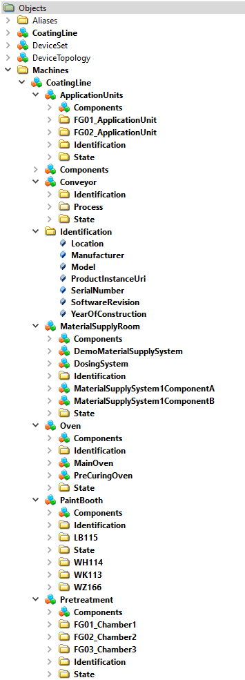
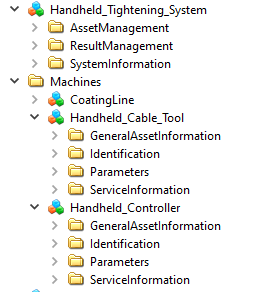

# Prototype implementations of OPC UA Companion Specifications

Based on the Hannover Messe 2021 demonstration of the VDMA Group OPC UA for Surface Technology.

## Sample Server

This Sample Server implementation should help companion specification working groups to easily implement a first running server.

This repository provides a container image to be run by Docker as well as a running instance of the `main` branch at `opc.tcp://opcua2.umati.app:4840`

  

## Folder Structure

```text
├──.github              GitHub Workflows
├──doc/images           Documentation and images      
├──nodeset              Normative NodeSet files as copy from OPC-Foundation
├──src
    |-data
        |-datasets      Datasets for update variable of the virtual coating line instance
    |-models            XML NodeSets containing the instances of machines in the server
```

## Modell View Surface Technology



## Modell View Industrial Joining Technology


